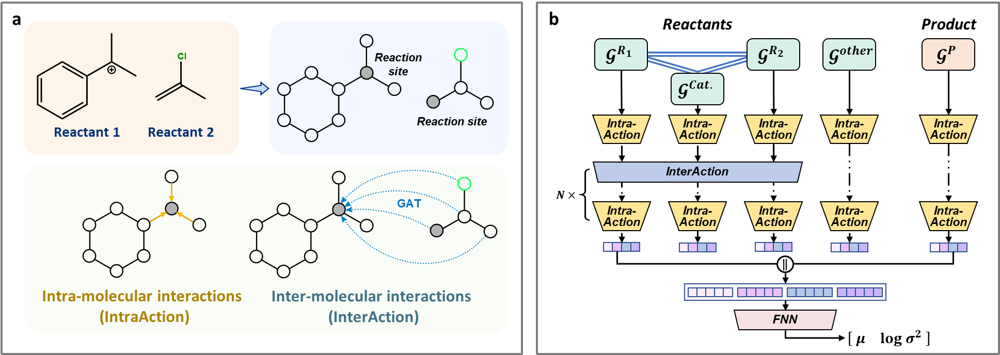

# ReacHGNN
A novel molecular graph heterogeneous graph neural network (HGNN) for capturing local intermolecular reactivity.

## Overview
This repository includes the codes and results for our paper:
***Capturing inter-molecular reactivity using heterogeneous graph neural network***

ReacHGNN aims to provide a general framework for solving inter-molecular reaction performance prediction tasks, including the construction method of reaction heterogeneous graph (***RHG***) representation and the corresponding neural network architecture (***ReacHGNN***). It supports the prediction of different types of reactivity indicators such as reaction yield, transition state energy barrier, enantioselectivity and reaction rate constant which are included in this repo.

<p align="center">
  <a href="https://github.com/Masker-Li/ReacHGNN/figures">
    
  </a>
</p>

## Installation
Please first clone our repo and install using the setup.py. All the dependencies are listed in the ```requirements.txt```.

```
git clone https://github.com/Masker-Li/ReacHGNN.git
cd ReacHGNN
pip install requirements.txt (if needed)
python setup.py install 
```

## Content list
The descriptions of files in each folder are listed in the corresponding ```README.md``` file in the folder 

* [datasets](datasets) contains the raw data for four benchmark datasets and the reorganize Mayr dataset obtained from the original publications and [Mayr’s Database of Reactivity Parameters](https://www.cup.lmu.de/oc/mayr/reaktionsdatenbank2).

* [examples](examples) contains the notebooks and selected initial experiments used to collect all the results, and also the results presented in the manuscript.

* [reachgnn](reachgnn) contains the source codes of ***RHG*** and ***ReacHGNN***


## Citing ReacHGNN
